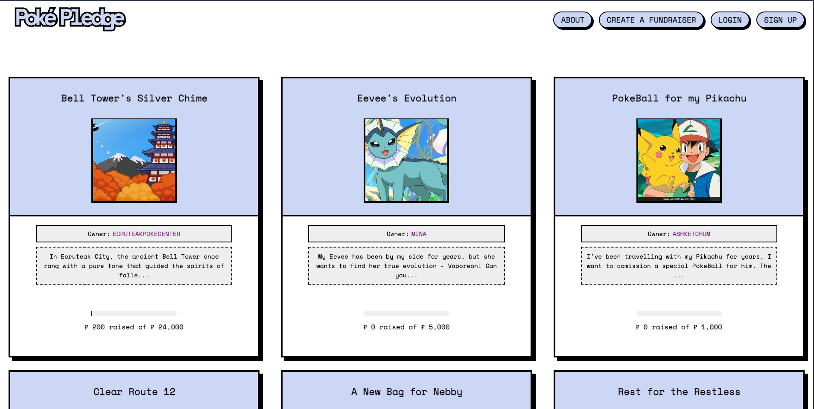
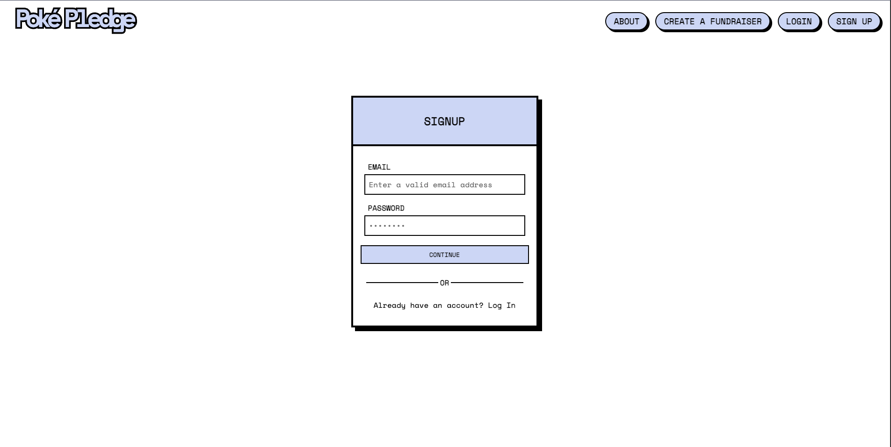
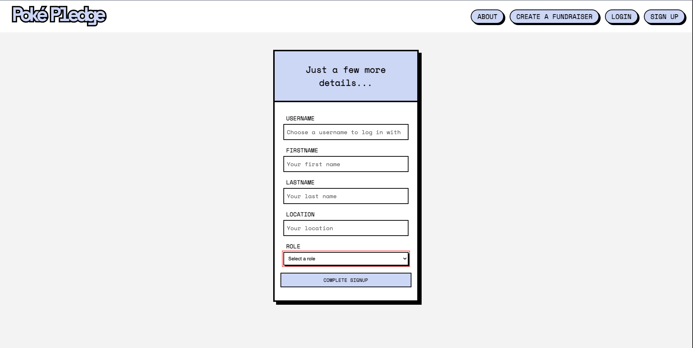
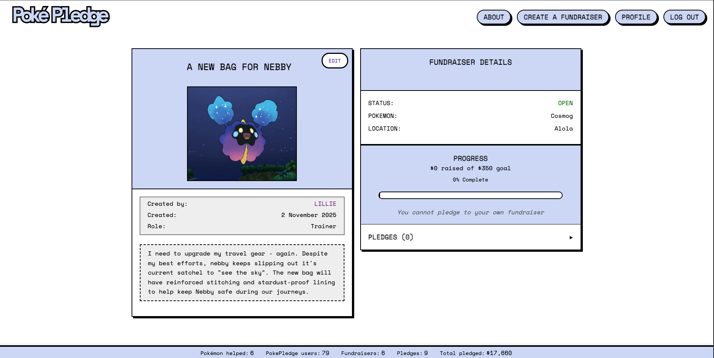
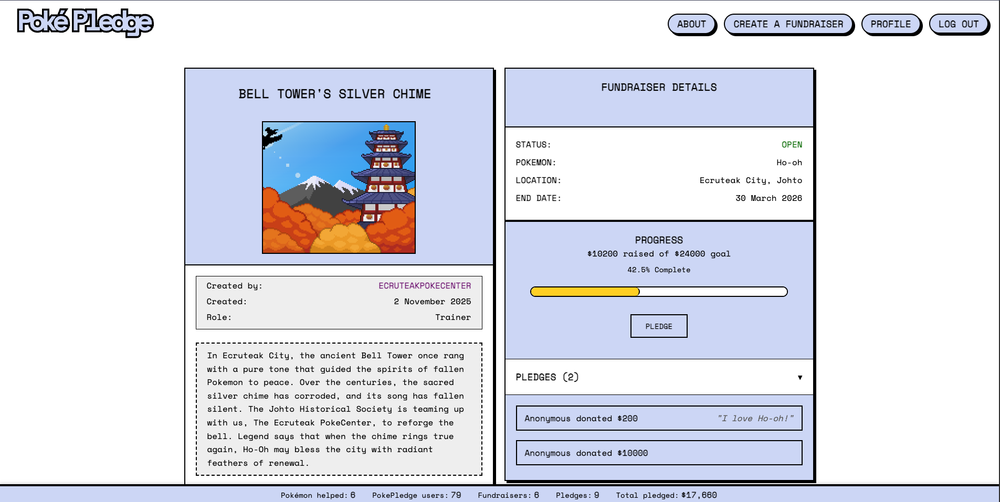
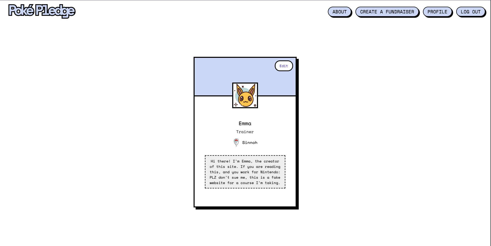
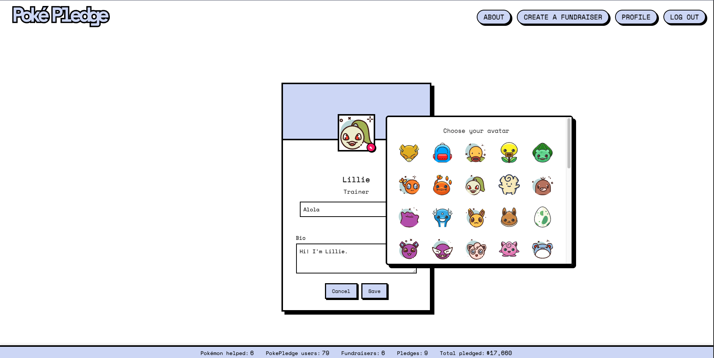
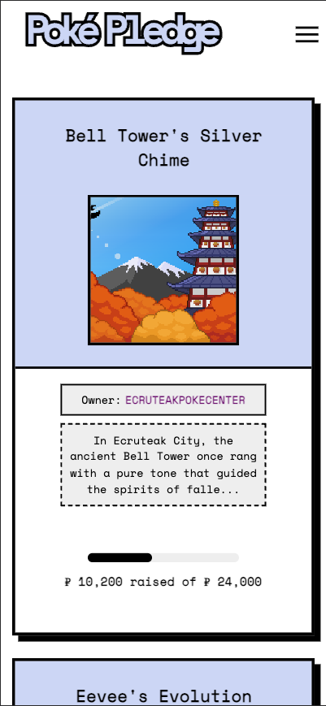
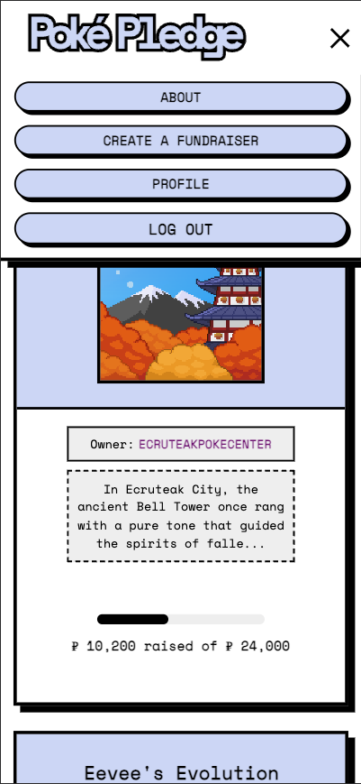
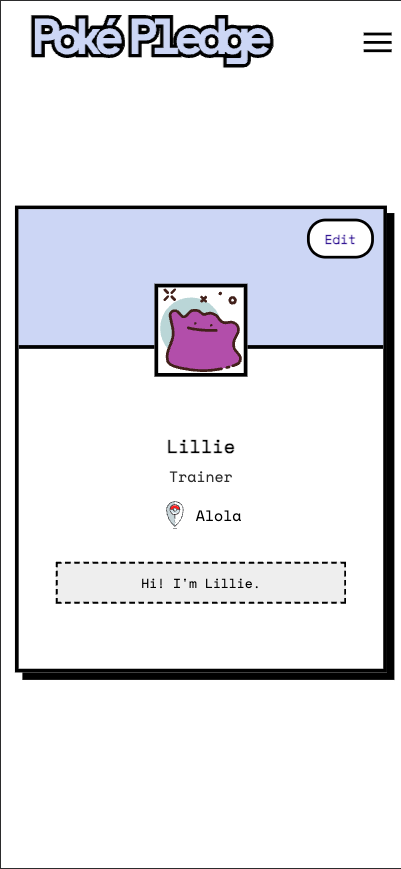

# PokePledge - Crowdfunding Front End

### Concept/Name
**PokePledge** is a crowdfunding app with a whimsical, Pokémon twist. 
Trainers can create fundraisers on behalf of their Pokémon — like Snorlax asking for a beanbag chair or Eevee hoping for a special crystal to ✨ evolve ✨ — and the community can pledge support to bring those wishes to life.  

### To view - [PokePledge](https://pokepledge.netlify.app/) 

### Intended Audience/User Stories
The intended audience includes:
- **Pokémon trainers** who want to create fundraisers on behalf of their Pokémon. 
- **Pokémon Centers** who want to create fundraisers to benefit the community.
- **Safari Parks** who want to create fundraisers to raise money for Pokémon welfare. 
- **Supporters** who enjoy pledging to bring those Pokémon dreams to reality.  

### Front End Pages/Functionality
- **Home Page**
  - View fundraisers
  - View stats

- **Fundraiser Detail Page**
  - Displays fundraiser description, goal, progress, and pledges.  
  - “Pledge” form for logged-in users.  
  - Preview of recent non-anonymous pledges (username, amount, comment)

- **User Account Pages**
  - Signup, log in, log out. 
  - Update account details or delete account.
  - Create, view, and edit own profile.

- **Create/Edit Fundraiser Page**
  - Form to create new fundraisers.
  - Ability to edit or delete fundraisers you own. 

## Additional Features

### User Profiles
- Using Django's advanced signals feature to automatically create profiles when users sign up
- No setup required: users can start using the platform immediately
- Customizable profiles with bio and the option to change their avatar
- Zero-error approach: every user is guaranteed to have a profile, preventing broken links or missing data
- Upon profile creation, users are assigned an avatar based on role. This can be changed.

### Site Stats
- Live dashboard showing the impact of the PokePledge community
- Implemented using Django signals to ensure real-time accuracy
- Stats update whenever:
  - New users join the community
  - Pledges are made to help Pokémon
  - Fundraisers successfully reach their goals
- Track key metrics like total Pokémon helped, total amount pledged, and community size
  
## Link to [Backend](https://github.com/elspear/crowdfunding_backend)

## Homepage
### Logged out

### Logged in

## Log In

## Sign up 
### Step one

### Step two

## Fundraiser Page
### Own fundraiser

### Non-owned fundraiser

## Profile
### Profile view

### Edit profile w/ avatar picker

### Mobile responsive w/ hamburger menu

